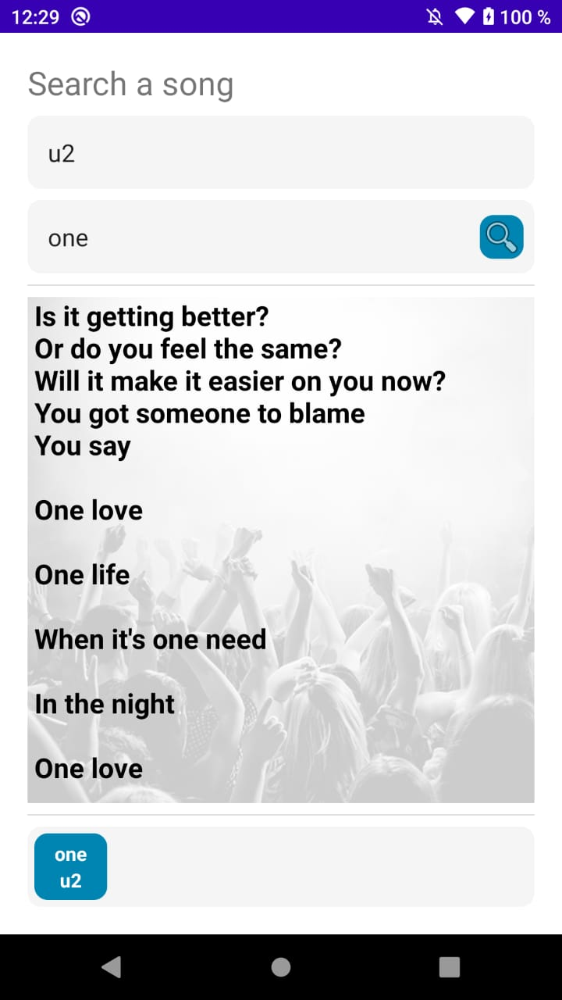

# Lyrics Search App
This is an app for search lyrics using the [lyrics.ovh API](https://lyricsovh.docs.apiary.io/#reference/0/lyrics-of-a-song/search?console=1).

## Installation
This is an Android Studio Project. You just clone the repo; next open in your IDE and run!

## Compatibility
This app was created with minimun API Level 16.

## Features
- MVVM Pattern
- Recyclerview with Viewholder
- Constraint Layout
- Retrofit 2
- Dark and Light Theme
- Search a song
- History of search
- All works with fragments and one activity

## Screens
| Home |
|--|
|  |